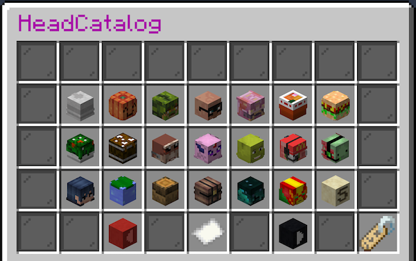
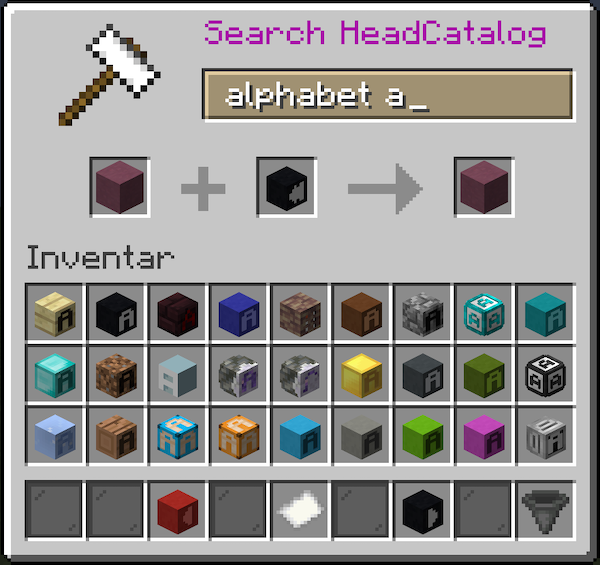

<!-- This file is rendered by https://github.com/BlvckBytes/readme_helper -->

# HeadCatalog

A simple-to-use catalog for browsing through massive amounts of heads in an efficient manner.

## Table of Contents
- [Configuration File](#configuration-file)
  - [Section "command"](#section-"command")
  - [Section "permissions"](#section-"permissions")
  - [Section "messages"](#section-"messages")
    - [headsNotReadyYet](#headsnotreadyyet)
    - [inventoryFull](#inventoryfull)
    - [requestedHeadPriceBypassed](#requestedheadpricebypassed)
    - [requestedHead](#requestedhead)
    - [missingBalance](#missingbalance)
    - [economyError](#economyerror)
  - [Head Model](#head-model)
  - [Section "gui"](#section-"gui")
    - [representative](#representative)
  - [Section "source"](#section-"source")
    - [updatePeriodSeconds](#updateperiodseconds)
    - [apis](#apis)
  - [API List Entry](#api-list-entry)
    - [urls](#urls)
    - [userAgent](#useragent)
    - [dataType](#datatype)
    - [arrayExtractor](#arrayextractor)
    - [itemMapper](#itemmapper)

## Configuration File

The configuration file makes use of [BukkitEvaluable](https://github.com/BlvckBytes/BukkitEvaluable), so it is advised
to also get familiar with the *README* of that project in order to fully understand the process of customizing the plugin.

### Section "command"

See [BukkitCommands](https://github.com/BlvckBytes/BukkitCommands).

### Section "permissions"

See [BukkitEvaluable](https://github.com/BlvckBytes/BukkitEvaluable).

| Internal Name | Description                                       |
|---------------|---------------------------------------------------|
| open          | Open the UI                                       |
| request       | Request a head by clicking on it                  |
| priceBypass   | Bypass the price of a head and never pay anything |

### Section "messages"

#### headsNotReadyYet

The heads are still loading, which either means that the persistence is not done reading yet or that
the process of mapping head models to head representative items has not yet completed.

#### inventoryFull

The requested head item could not be placed in the player's inventory, as it has no more space to hold it.

#### requestedHeadPriceBypassed

Printed after requesting a head if the player has the `priceBypass` permission and thus didn't have to pay money.

| Environment Variable | Description                   |
|----------------------|-------------------------------|
| head                 | The [head model](#head-model) |

#### requestedHead

Printed after requesting a head which was either free (price = 0) or which cost some amount of money.

| Environment Variable | Description                   |
|----------------------|-------------------------------|
| head                 | The [head model](#head-model) |

#### missingBalance

The player is missing some amount of balance in order to purchase the selected head.

| Environment Variable | Description                       |
|----------------------|-----------------------------------|
| balance              | The current balance of the player |
| head                 | The [head model](#head-model)     |

#### economyError

An error within the economy system occurred.

| Environment Variable | Description                                  |
|----------------------|----------------------------------------------|
| error_message        | Error message provided by the economy system |
| head                 | The [head model](#head-model)                |

### Head Model

The head model is sometimes passed as an environment variable to certain config properties, and contains
the following accessible members:

| Member     | Type        | Description                                   |
|------------|-------------|-----------------------------------------------|
| name       | String      | Name of the head                              |
| skinUrl    | String      | URL of the head's skin                        |
| uuid       | UUID        | UUID corresponding to this head               |
| categories | Set<String> | The categories this head is in                |
| tags       | Set<String> | The tags which have been added to this head   |
| price      | Double      | The price of the head                         |
| lastUpdate | Date        | Last update or (if not updated) creation date |

### Section "gui"

#### representative

An item description which is evaluated for each available head in order to generate representative items for the UI.

| Environment Variable | Description                                  |
|----------------------|----------------------------------------------|
| head                 | The [head model](#head-model)                |

In order to convert the locally stored skin sprite URL back to a base64 textures value, the environment provides an
encoder [function](https://github.com/BlvckBytes/BukkitEvaluable#skin_url_to_base64).

### Section "source"

#### updatePeriodSeconds

The time in seconds between updates. Every time an update occurs, all provided APIs are queried for their
data and new heads are extended into the local database. The minimum time accepted by the plugin is 24h, which
is `86400` seconds.

#### apis

A list of [API entries](#api-list-entry) and their properties, which feed the local database.

### API List Entry

#### urls

A list of urls which will all be queried and processed using this entry's settings.

#### userAgent

Some APIs don't answer if the request doesn't contain a valid `User-Agent` header. You can specify
any custom string here, but the default value should work across the board.

#### dataType

The type of response this endpoint issues. Currently, there's only **JSON** available.

#### arrayExtractor

A function which extracts the array of heads from the response of the API. This array will later be iterated
and mapped to heads by the mapper function. If the API already responds with a top level array, just let this
function be a pass-through by putting `result` as it's value.

| Environment Variable | Description                                  |
|----------------------|----------------------------------------------|
| result               | The unmodified, parsed response from the API |

#### itemMapper

This mapper maps each item (entry) within the previously extracted array to a head model, to be stored locally. It will
be called with each entry individually and has to yield a model.

| Environment Variable | Description                                                 |
|----------------------|-------------------------------------------------------------|
| item                 | The currently iterated item of the extracted array          |
| url                  | The currently requested URL from the list of urls           |
| make_head            | A function which constructs a head model by it's parameters |

The `make_head` function accepts the following parameters:

| Parameter  | Type               | Required | Description                     |
|------------|--------------------|----------|---------------------------------|
| name       | String             | yes      | Name of the head                |
| skinUrl    | String             | yes      | URL of the skin sprite          |
| uuid       | String             | false    | UUID to use for the GameProfile |
| categories | Collection<String> | false    | Categories this head is in      |
| tags       | Collection<String> | false    | Tags attached to this head      |
| price      | Double             | false    | Price of this head              |

If the API of choice responds with a `base64`-encoded `textures` value, the environment provides an extractor
[function](https://github.com/BlvckBytes/BukkitEvaluable#base64_to_skin_url) to decode that value and extract
it's URL string.